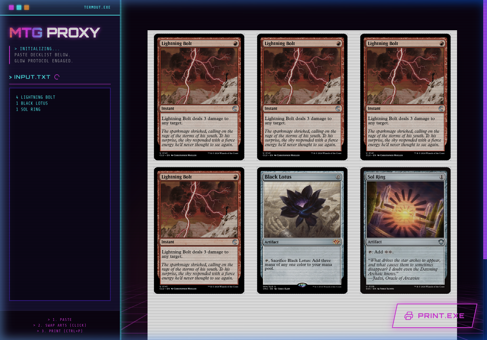
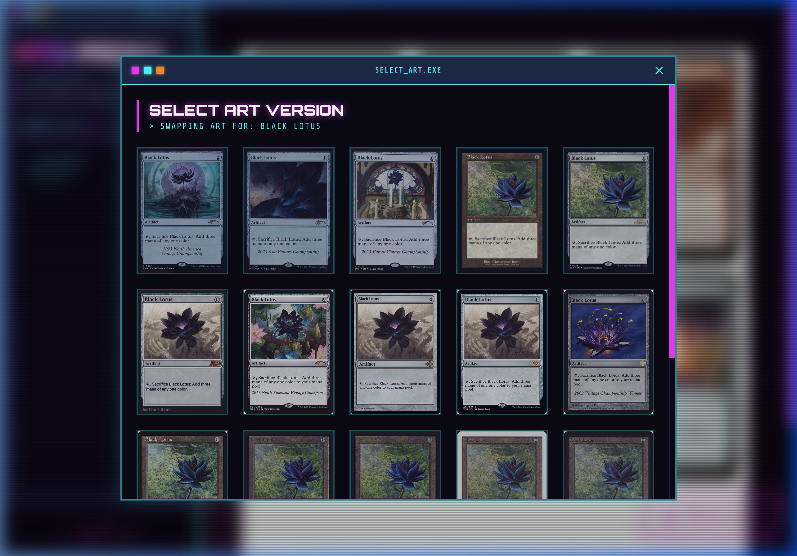

# MTG Proxy Outrun Generator 🖲️

**"Digital Nostalgia meets Neon Future — A synthetic reality drenched in retro-futuristic excess."**



A blisteringly fast, retro-futuristic Magic: The Gathering proxy sheet generator. Paste a decklist, fetch high-resolution imagery from the Scryfall API, and inject your proxies directly into a precisely scaled 8.5" x 11" printable PDF layout. 

## ✨ Features

- 🌆 **Outrun & Vaporwave Aesthetic**: Built from the ground up featuring an aggressive neon visual language. Glowing hot magenta and electric cyan terminal interfaces layered over perspective grid depth. 
- 🎴 **Precision Print Engine**: While your screen bathes in neon, pressing `CMD/CTRL + P` instantly transforms the interface. It utilizes strict `@media print` directives to strip all dark backgrounds, scale card objects identically to authentic dimensions (2.5" x 3.5"), and produce an ink-saving array complete with dashed 1px cutting guides.
- 🔄 **Intelligent Art Swapping (`SELECT_ART.EXE`)**: Hover over any generated card and click to open a secondary terminal interface. It automatically retrieves the complete printed history of the card, allowing you to swap out instances for special editions and alternate arts without breaking your layout.
- 🎭 **Flip-Card / DFC Support**: Seamlessly detects dual-faced cards (like *Ajani, Nacatl Pariah*). It handles the Scryfall fetching logic and intelligently pushes the backside face as an independent card item on your print sheet so you're never caught lacking during a transformation!
- 📡 **Rate-Limited API Integration**: Respects Scryfall's developer guidelines using built-in Axios promise queues structure to limit traffic velocity automatically.

## 📸 Interface Previews

### The Terminal Decklist Prompt
Load up your standard `1x Card Name` or `4 Card Name` list into the main deck input.

### Art Selection Frame

Clicking on an individual image triggers the query layer, dropping a glassmorphic frame to retrieve alternative art choices dynamically. 

## 🚀 Getting Started

Deploy standard dependencies with NPM and initialize the Vite configuration.

```bash
# Clone the repository
git clone https://github.com/yourusername/mtg-proxygen.git

# Enter the terminal
cd mtg-proxygen

# Satisfy dependencies
npm install

# Engage the development server
npm run dev
```

Browse to `http://localhost:5173/` in your preferred viewport.

## 🛠 Tech Stack
- Frontend Engine: `React 19`
- Build System: `Vite 6` 
- Styling Pipeline: `Tailwind CSS v4`
- Icons: `lucide-react`
- Data Protocol: `Axios` handling the `Scryfall REST API`

## 🤝 Contributing
Open a pull request or submit an issue ticket if you encounter any bugs within the Scryfall parsing matrix!
